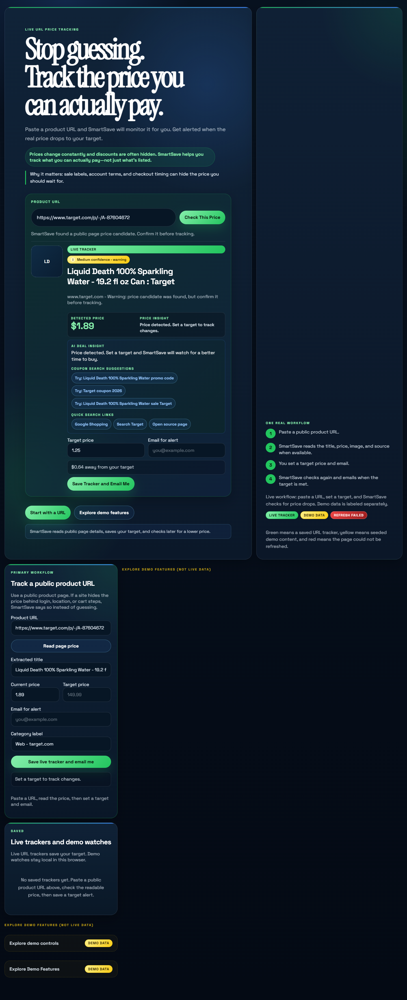
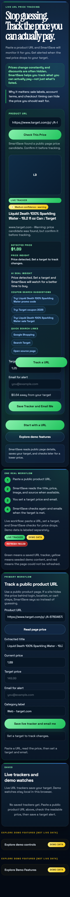

# SmartSave

SmartSave helps shoppers avoid overpaying by turning a public product page into a price tracker. A user pastes a URL, SmartSave reads the price metadata it can access, the user sets a target price and email, and a scheduled backend check sends an alert when the target is reached.

The product is intentionally narrow. Demo datasets are included for browsing and presentation, but they are secondary and clearly labeled as demo-only.

## Links

- Live website: https://smartsave-compare.netlify.app
- Website and app README: https://github.com/christianCorona27/smartSave#readme

## Preview





## Core Live Workflow

1. Paste a public product URL.
2. SmartSave reads public page metadata such as title, price, image, hostname, currency, and confidence level.
3. The user confirms the detected price.
4. The user enters a target price and email address.
5. The backend stores the tracker in Netlify Blobs.
6. A scheduled Netlify Function re-fetches the saved URL.
7. SmartSave updates current price and price history.
8. Resend sends an email alert when the readable page price is at or below the target.

This is the working product path. The app does not claim broad real-time retailer coverage.

## Live Features

- Public URL parsing through `GET /api/link-preview`.
- Price confidence labels for parsed pages: high, medium, or low.
- Cautious price insight based on the detected price, confidence, and the user's target.
- User-confirmed tracker creation through `POST /api/track-url`.
- Target price and email capture.
- Tracker storage with Netlify Blobs.
- Scheduled backend refresh through `netlify/functions/price-alert-sweep.mts`.
- Compact price history for saved trackers.
- Optional OpenAI-powered deal insight for parsed products when `OPENAI_API_KEY` is configured.
- Coupon and shopping search suggestions generated from the detected title and source.
- Email alert delivery through Resend when environment variables are configured.
- Clear status badges for `Live Tracker`, `Demo Data`, and `Refresh Failed`.

## Demo-Only Features

The demo catalog exists to show UI behavior and comparison logic without requiring a user to create live trackers first. It is not live provider data.

Demo-only areas include:

- Seeded product and service comparison cards.
- Seeded retailer, lender, dealership, and service-provider examples.
- Demo student, senior, service-member, and coupon assumptions.
- Demo ZIP matching.
- Demo bulk, reorder, APR, and planning helpers.
- Seeded price history charts.

These examples are useful for judging the interface, but they are not connected to real retailer APIs, lender APIs, dealership inventory, coupon systems, or real-time service-provider feeds.

## Accuracy Boundaries

SmartSave reads public product-page metadata only. It does not bypass login screens, private pages, paywalls, anti-bot systems, shopping carts, account-only pricing, location-specific checkout flows, or JavaScript-only price rendering.

If a page does not expose a readable price, SmartSave shows a low-confidence or failed result instead of inventing a price.

Price insight is intentionally simple. It uses the detected price, confidence level, and available history only; it does not claim full market intelligence.

## API Routes

### `GET /api/link-preview`

Reads public product-page metadata.

Example:

```text
/api/link-preview?url=https%3A%2F%2Fexample.com%2Fproduct
```

Typical response fields:

- `ok`
- `url`
- `hostname`
- `title`
- `description`
- `price`
- `currency`
- `image`
- `confidence`
- `message`

### `POST /api/track-url`

Creates a saved live tracker.

Example payload:

```json
{
  "url": "https://store.example.com/product",
  "confirmedTitle": "Example Product",
  "confirmedPrice": 199.99,
  "targetPrice": 149.99,
  "email": "you@example.com"
}
```

The endpoint re-fetches the URL before storing the tracker. If the page does not expose a readable price, it returns an error rather than creating a fake live tracker.

### `GET /api/track-url`

Reads a stored tracker when provided a tracker id and matching email. The frontend uses this to refresh stored price history after scheduled checks.

### `POST /api/deal-insight`

Generates one short product insight and coupon search suggestions from the detected title, source, price, and target. It uses the OpenAI API when `OPENAI_API_KEY` is configured and falls back to deterministic search suggestions when it is not.

## Scheduled Refresh

`netlify/functions/price-alert-sweep.mts` runs hourly on published Netlify deploys. It loads stored trackers, re-fetches each saved public URL, updates current price and price history, records refresh failures safely, and sends an email alert when the target is met.

## Environment Variables

Email alerts require these Netlify environment variables:

```text
RESEND_API_KEY=your_resend_api_key
ALERT_FROM_EMAIL=alerts@example.com
```

Without these values, trackers can still be stored and refreshed, but email delivery will not be sent.

OpenAI deal insights require:

```text
OPENAI_API_KEY=your_openai_api_key
OPENAI_MODEL=gpt-4o-mini
```

Without `OPENAI_API_KEY`, SmartSave still shows deterministic fallback insight and search links.

## Local Development

Install dependencies:

```powershell
npm install
```

Run a static-only preview:

```powershell
powershell -ExecutionPolicy Bypass -File .\start-website.ps1
```

Run with Netlify Functions locally:

```powershell
npm run dev
```

Use the Netlify dev URL when testing `/api/link-preview` and `/api/track-url`.

## Build

```powershell
npm run build
```

The build writes static files to `dist/`. Netlify publishes `dist` and bundles functions from `netlify/functions`.

## Project Structure

- `index.html` - live tracker interface, collapsed demo sections, templates, and page structure.
- `styles.css` - dark visual system, responsive layout, badges, preview panel, and chart styling.
- `script.js` - frontend state, live tracker flow, demo behavior, price history rendering, and backend sync.
- `scripts/build.mjs` - static build script.
- `netlify/functions/link-preview.mts` - public URL preview endpoint.
- `netlify/functions/track-url.mts` - tracker create/read endpoint.
- `netlify/functions/deal-insight.mts` - optional OpenAI insight and coupon search suggestion endpoint.
- `netlify/functions/price-alert-sweep.mts` - scheduled refresh and alert processor.
- `netlify/functions/lib/page-reader.mts` - public-page fetch and metadata parsing logic.
- `netlify/functions/lib/alerts.mts` - tracker storage, validation, and email helper logic.
- `netlify/functions/local-match.mts` - demo-only ZIP matching endpoint.
- `netlify/functions/lib/provider-directory.mts` - demo-only provider directory.
- `netlify.toml` - Netlify build and functions configuration.

## Limitations

- Public-page extraction depends on the source site exposing usable HTML metadata.
- Some prices are rendered only after JavaScript, login, location selection, cart state, or account-specific checkout steps.
- Email delivery depends on Netlify scheduled functions and configured Resend credentials.
- Demo prices, discounts, APRs, provider matches, and histories are seeded examples.
- SmartSave does not buy items, reserve inventory, apply checkout coupons, or guarantee final checkout price.

## Future Features

- Retailer API integrations for a small number of officially supported stores.
- Browser extension for saving product pages directly while shopping.
- Expanded provider network with clear integration status for each source.
- Smarter deal scoring based on confidence, fees, shipping, eligibility, and price history.
- Multi-item optimization for comparing baskets, bundles, and recurring purchases.
